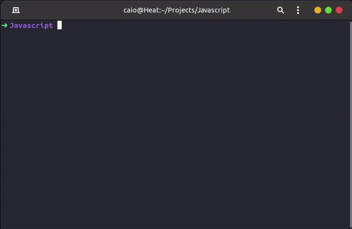

# Bem vindo ao projeto Crypto Curr!


## Introdução:

Esse projeto foi desenvolvido no final do módulo de Fundamentos do Desenvolvimento Web da Trybe. Projeto foi realizado em grupo, com outros estudantes da [Trybe](https://www.betrybe.com), e ajudou a fixar conteúdos vistos no Módulo ínicial do curso, principalmente de requisições assíncronas via APIs. 

## Autores:

[Pedro Guarize](https://www.linkedin.com/in/pedroguarize/)
[Caio Lima](https://www.linkedin.com/in/caio-limah/)
[Thiago Monteiro](https://www.linkedin.com/in/thiagoacmonteiro/)

## Stack utilizada:

- HTML
- CSS
- JAVASCRIPT
- JEST
- BIBLIOTECA BULMA

## Deploy

[Link para o deploy do projeto](crypto-curr.luizmodolo.dev).

## Instruções:

## Rodando localmente

Clone o projeto

```bash
  git clone git@github.com:LuizModolo/crypto_curr.git
```

Entre no diretório do projeto

```bash
  cd recipe_app
```

Abra a aplicação com a ferramenta LiveServer do VSCode.

### Testes

Para rodar os testes siga os seguintes passos:

Clone o projeto

```bash
  git clone git@github.com:LuizModolo/crypto_curr.git
```

Entre no diretório do projeto

```bash
  cd recipe_app
```

Ao entrar na pasta é só digitar `npm test` que os testes irão rodar localmente no seu terminal.


